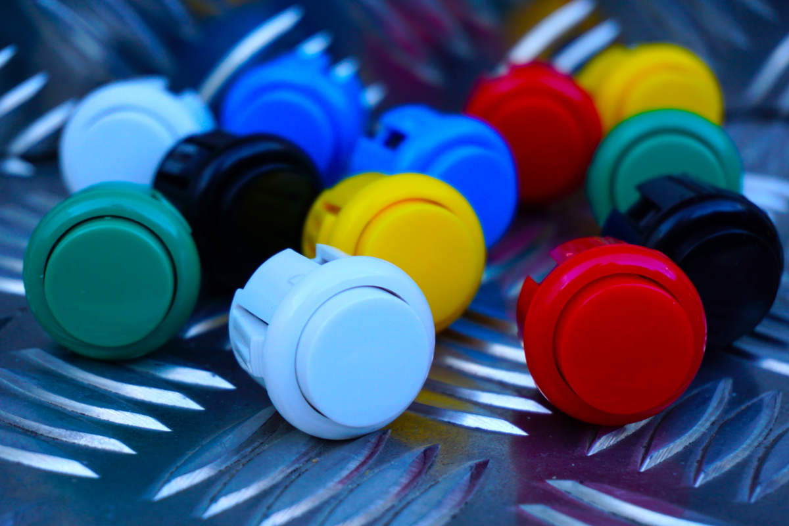

Soundboard
===================

[](https://github.com/micha37-martins/soundboard)
[](https://pkg.go.dev/micha37-martins/soundboard)
[](https://goreportcard.com/report/github.com/micha37-martins/soundboard)
[](https://codecov.io/gh/micha37-martins/soundboard)

A Soundboard for Raspberry Pi.



Contents
----
- [What is the purpose of this tool?](#what-is-the-purpose-of-this-tool?)
- [How does it work?](#how-does-it-work?)
- [Build](#build)
- [Prerequisites](#prerequisites)
- [Build and run soundboard container](#build-and-run-soundboard-container)
- [Recommendations](#recommendations)
- [Configuration](#configuration)
- [Testing](#testing)
- [Todo](#todo)

What is the purpose of this tool?
----
This tool enables your Raspberry Pi to play a specific sound-file by pressing a  
button connected via GPIO.

How does it work?
----
Depending on the number of buttons to use, the soundboard creates listeners  
for the GPIO pins. If a button is pushed the associated sound-file will be played.  
During playback no inputs from push buttons will be accepted.

Build
----
Linux (Raspbian)

Install needed Debian packages:
```sh
sudo apt-get install build-essential libasound2-dev alsa-lib
```

Get dependencies:
```sh
go get -u github.com/hajimehoshi/oto
go get -u github.com/faiface/beep
go get -u github.com/micha37-martins/gpio
```

Prerequisites
----

### Hardware

- Raspberry PI 3 (other versions should also work but I did not test them)
- SD Card
- Power supply
- Wiring
- Pushbuttons
- A suitable case for a soundboard

### Recommendations

It is expected to have a [`Pull-Up-Resistor`](https://en.wikipedia.org/wiki/Pull-up_resistor)  
for every push button connected. The resistor should have between 10 and 100 k&#8486;.

### Software

- I tested with Raspbian but other operating systems should also work
- golang 1.14+
- `make`

Older software versions may also work, but I did not test that.

Build and run soundboard container
----
Find your sound device by using
```sh
aplay -l
```

Use environment variable to set your desired sound device

examples:
```sh
ALSA_CARD=PCH
ALSA_CARD=HDMI

```

Build container
```sh
docker build -t soundboard .
```

Run container
```sh
docker run -it --rm --device /dev/snd -e "ALSA_CARD=SET_SOUND_DEVICE" soundboard:0.0.1 /bin/sh
```
Play test sound:
```sh
speaker-test
```


Configuration
----
Configuration is done in `/internal/config/config.go`

Here the mapping between file and pin is set. The `FileMapper`  
function assigns a filename to the corresponding button. The button  
number has to be a two digit string:
`For example: "01" for your first button`

The pin number for Raspberry Pi 2/3/4 can be found at  
[`raspberrypi.org`](https://www.raspberrypi.org/documentation/usage/gpio/)  

Example:
Map pin 5 to file 01

```go
ButtonMap[5] = "01"
```

The number of entries in `ButtonMap` have to equal the number of soundfiles.

Testing
----
A usual go test is configured in the `Makefile` but it will not do an integration test. If you want to check if the soundboard plays a file use:
```sh
go test -tags=integration
```

Todo
----
- write a soundboard.service example to document how to start
  soundboard using Systemd
- add troubleshoot if filecheck fails cause of empty dir
